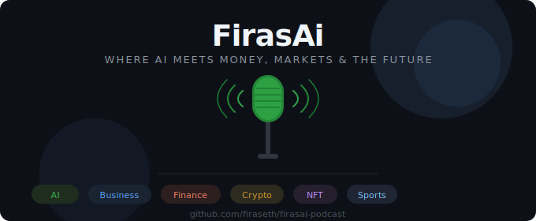

# 🎙️ FirasAi Podcast — AI-Powered Media Business Blueprint

> *Where AI Meets Money, Markets, and the Future*

A complete, production-ready system for launching and running an **autonomous AI-powered podcast business** — covering AI, business, finance, crypto, NFTs, and sports.


---

## 🗂️ Repository Structure

```
firasai-podcast/
├── 01-Overview-Stack-Build.md     # Sections 1–3: Overview, tech stack & 12-phase build guide
├── 02-Prompts-Library.md          # Section 4: 40+ ready-to-use AI prompts
├── 03-Notion-Template.md          # Section 5: Full Notion workspace setup
├── 04-Make-Blueprints.md          # Section 6: Make.com automation blueprints
├── 05-AI-Agent-Code.md            # Section 7: Python agent reference (narrative)
├── FirasAi-Complete-Bundle.md     # Master bundle — all sections in one file
├── DEPLOYMENT.md                  # Deployment guide (local, cloud, free AI)
├── agents/                        # Python agent modules
│   ├── planner.py
│   ├── researcher.py
│   ├── scriptwriter.py
│   ├── editor.py
│   ├── marketer.py
│   └── analyst.py
├── tools/
│   ├── notion_tool.py
│   └── audio_tool.py
├── main.py
├── config.py
├── requirements.txt
└── .env.example
```

---

## 🚀 What You're Building

You're not just starting a podcast — you're building a **fully autonomous AI-powered media business** that runs on autopilot.

| Pillar | What AI Does |
|---|---|
| 📋 Planning | Suggests topics, builds content calendars, finds trending angles |
| 🔍 Research | Pulls live data, stats, quotes, and fact-checks scripts |
| ✍️ Scripting | Writes 30-min scripts, show notes, cold opens, and hooks |
| 🎙️ Production | Transcribes audio, removes filler words, finds viral clips |
| 📣 Marketing | Creates social posts, newsletters, blog posts, and threads |
| 📊 Analytics | Generates weekly performance reports and growth insights |

---

## 📚 Documentation Guide

| File | What's Inside |
|---|---|
| [01-Overview-Stack-Build.md](./01-Overview-Stack-Build.md) | Full tech stack with costs, 12-phase build guide |
| [02-Prompts-Library.md](./02-Prompts-Library.md) | 40+ prompts: planning, scripting, outreach, social, analytics |
| [03-Notion-Template.md](./03-Notion-Template.md) | Command center, episode DB, guest pipeline, content calendar |
| [04-Make-Blueprints.md](./04-Make-Blueprints.md) | Make.com automation blueprints for the full publish pipeline |
| [05-AI-Agent-Code.md](./05-AI-Agent-Code.md) | Annotated walkthrough of the Python agent architecture |
| [FirasAi-Complete-Bundle.md](./FirasAi-Complete-Bundle.md) | All sections merged — good for reading end-to-end |

---

## ⚡ Free Installation

### Prerequisites
- Python 3.11+ → [python.org](https://python.org)
- Git → [git-scm.com](https://git-scm.com)

### Install

```bash
# 1. Clone the repo
git clone https://github.com/firaseth/firasai-podcast.git
cd firasai-podcast

# 2. Install dependencies
pip install -r requirements.txt

# 3. Set up environment
cp .env.example .env
# Open .env and add your API keys

# 4. Run
python main.py
```

---

## 🖥️ Deployment Options

See the full guide → [DEPLOYMENT.md](./DEPLOYMENT.md)

### Option 1 — Local (Free, Easiest)
Run on your own PC. Zero cost. Works immediately.

### Option 2 — Railway.app (Free Cloud, Always On)
Deploy to the cloud in 5 minutes using your GitHub repo. No server management.

### Option 3 — Ollama (Zero API Cost)
Run open-source AI models locally. No OpenAI bills — ever.

| | Local | Railway | Ollama |
|---|---|---|---|
| Cost | Free | Free tier | Free |
| Always on | ❌ | ✅ | ❌ |
| Setup | Easy | Easy | Medium |
| AI quality | GPT-4 | GPT-4 | Good |

> **Start here:** Local + Ollama = zero cost. Scale to Railway when ready.

---

## 🔑 Required API Keys

| Service | Purpose | Get It |
|---|---|---|
| OpenAI | GPT-4 scripting & planning | [platform.openai.com](https://platform.openai.com) |
| Anthropic | Claude for long-form writing | [console.anthropic.com](https://console.anthropic.com) |
| ElevenLabs | AI voice & cloning | [elevenlabs.io](https://elevenlabs.io) |
| Notion | Content database | [notion.so/my-integrations](https://notion.so/my-integrations) |
| Perplexity | Real-time research | [perplexity.ai](https://perplexity.ai) |
| Buzzsprout | Podcast hosting & analytics | [buzzsprout.com](https://buzzsprout.com) |
| Beehiiv | Newsletter platform | [beehiiv.com](https://beehiiv.com) |
| Buffer | Social scheduling | [buffer.com/developers](https://buffer.com/developers) |

---

## 💰 Monthly Cost Breakdown

| Tier | Monthly Cost | Best For |
|---|---|---|
| Starter | ~$135/mo | Getting started, validating the show |
| Pro | ~$250/mo | Growing to 10k+ downloads |
| Enterprise | ~$500/mo | Full automation, multiple shows |

---

## 🤝 Contributing

See [CONTRIBUTING.md](./CONTRIBUTING.md) for guidelines.

---

## 📄 License

MIT — free to use, modify, and distribute. See [LICENSE](./LICENSE).

---

## 👤 Author

**Firas** — [@firaseth](https://github.com/firaseth)

> *"I'll see you in the future."*
